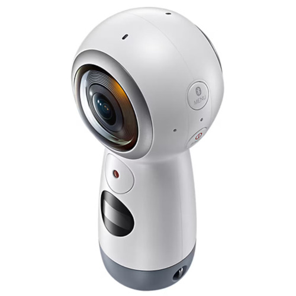
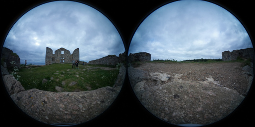
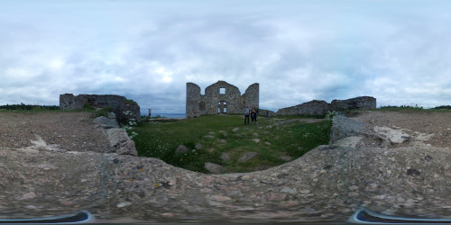
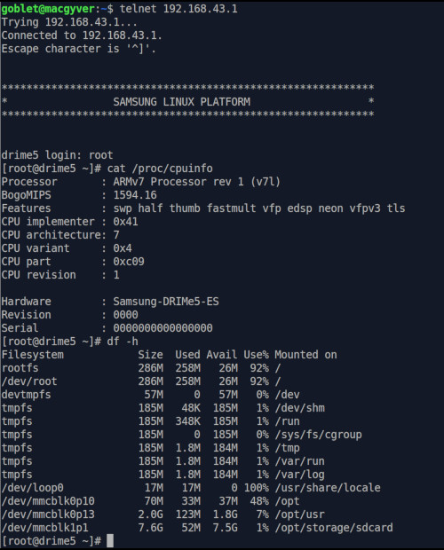

# Samsung Gear360 (2017) SM-R210 hack

## Preface

In the 2010s Samsung made many nice camera models, eg. 360° camera that I have, the Gear360 SM-R210 which was sold with name _"Gear360 (2017)"_.
Around 2020 they made a business decision and stopped further development. Firmware and phone software updates weren't developed or published anymore.
Eg. the app in Google Play doesn't work in newer Android versions anymore, although it worked in Samsung phones only. 
They also shut down their site www<area>.samsungimaging.com, where eg. the firmware updates were available.
 

Of course the the camera works standalone, but by default it generates dual fisheye images to the memory card. This is not what you want, 
because eg. Google Maps and social platforms want equirectangular projection. There are some software that can convert the photos,
but none of them look perfect and cause extra work afterwards on converting images. 
When there was the working phone app, it could stitch the image perfectly to equirectangular projection with its proprietary algorithm.

| Double Fisheye | Equirectangular |
| -------------- | --------------- |
| You don't want this | This is what you want |
|  |  |

The camera has Android, iOS and Street View modes. Google has abandoned the dedicated Street View phone app and integrated the Street View to the Maps app which unsurprisingly doesn't work with the camera. But that mode is the useful one, because it uses the internal stitcher that creates equirectangular images. The only requirement for to get that mode working is that a phone or other device is connected to the camera WiFi in that mode.

The mode has [OSC](https://developers.google.com/streetview/open-spherical-camera) REST API, but it is not used in this hack and Samsung hasn't even implemented all OSC features.

### What? Why?

I wanted to use the camera for taking 360° still photos while travelling even Samsung ruined it. I also wanted to use my phone as a remote controller. 
I don't really get the idea of 360° videos except eg. parachute jumps that I don't do. And for them who do it there are lot better and newer cameras available.
360° still photos are enough for me, so I made this hack for them. Maybe it works with video too, I'm not sure and I don't care.

## Requirements

This hack has been tested with firmware R210GLU0ARB2 only. At least that one has Street View mode and the internal stitching. If you need to upgrade the
firmware, you can download it from [XDA forums](https://xdaforums.com/t/mod-port-samsung-gear-360-manager-for-all-devices-updated-10-apr-24-v1-5-00-1-4.3400383/page-93) 
and use [updater by Kieron Quinn](https://github.com/KieronQuinn/Gear360_OSS/). Use the firmware file `R210GLU0ARB2_180201_1739_REV00_user.bin` which is probably the
last firmware Samsung published.

Download the `gear360hack.zip` and read the [INSTALL.md](INSTALL.md) and [USAGE.md](USAGE.md) 

## Internals

SM-R210 has an ARMv7 CPU and it is running Samsung's version of [Tizen Linux](https://www.tizen.org/). It has 2GB internal storage where
settings etc. are stored. That storage can be used for modificating the camera. There is a method for firmware upgrade that uses files `info.tg` and `nx_cs.adj`
files on the memory card and they can be used for launching any scripts. Almost everything, including checking existence of those files, is controlled by process `di-camera-app` which is launched by systemd in the boot. 

More info can be found eg. from [ottokiksmaler's](https://github.com/ottokiksmaler/gear360_modding) and [ultramango's](https://github.com/ultramango/gear360reveng)
github.

