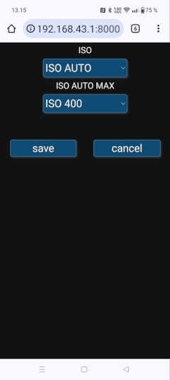

# Usage

1. While power on, long press the menu button.
2. Choose __Connect to Street View__. **NOTE:** This mode is mandatory. Otherwise you will get dual fisheye photos.
3. Connect to the camera WiFi. Its SSIDs are something like Gear360(FCE2) and Gear360(FCE2).OSC You can choose either of them. The WiFi password will be visible on screen and have 8 digits.
4. Open your browser to `http://192.168.43.1:8000`

 

The first screenshot is the front page. Note that the camera clock is not updating on the screen, but only when the page loads. It's very recommended to sync the clock.

Gallery is quite self explanatory.

On the settings page you can choose ISO and ISO AUTO MAX, if ISO is set to auto.

# Taking photos

Both the round photo button on the page or the physical button on the camera can be used for shooting. But it is important that some device is connected to the WiFi in Street View mode to get equirectangular photos.

When you shoot, there will be text "Capturing" on the screen for about 15 seconds. In reality it has already captured the photo, but it is stitching on the background. The camera has an old model ARMv7 processor and it is slow. Do not switch off the camera before that text has disappeared or otherwise the photo will be lost. If you have coordinates available (see below) then wait 2-3 seconds more. There
is yet another process launched onto the background and it waits the photo to be stitched and injects the coordinates to the EXIF after that.

# Getting coordinates to work

Modern browsers allow Geolocation API with secure origins only. It means that the schema should be https with valid certificate, which is impossible (or at least very difficult) to get working with this. There is a workaround to allow the browser use the Geolocation API with the camera URL.

### Google Chrome (and most likely Chromium too)

Open `chrome://flags` and search the setting "__Insecure origins treated as secure__" 
Set it to: `http://192.168.43.1,http://192.168.43.1:8000` 
You must restart the browser and when navigating to the camera URL, allow it to get location.

### Other browsers?

I don't know and just at the moment I am too lazy to google. If you know, please tell me.
